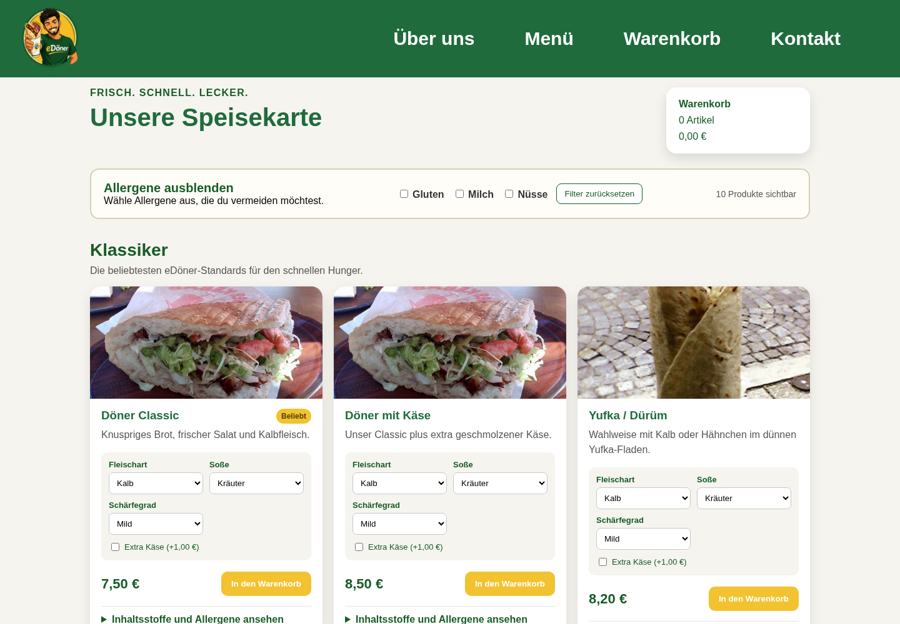
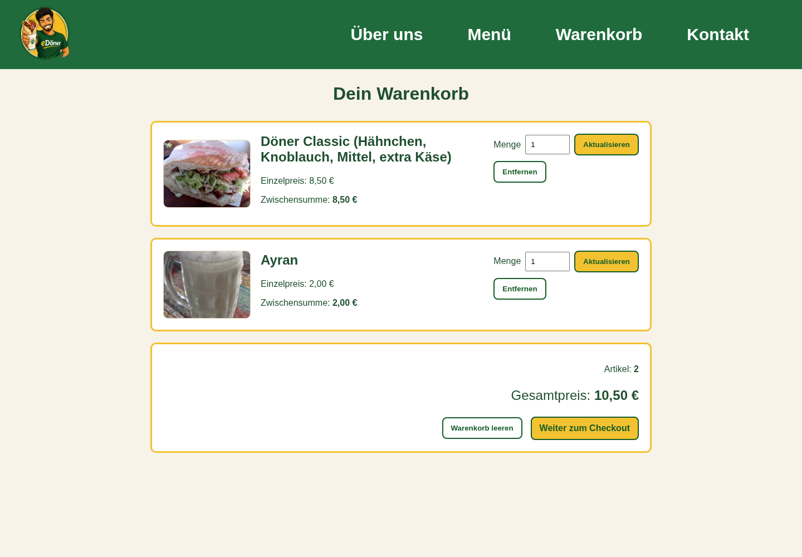
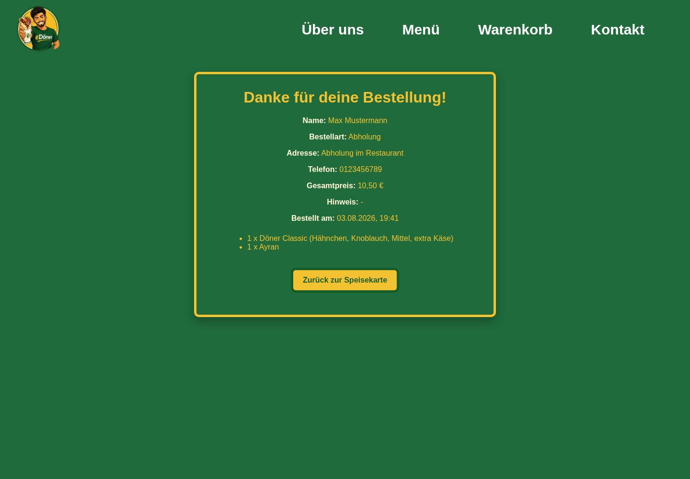

# Projektdokumentation eDöner

## 1. Projektübersicht

eDöner ist eine Webanwendung für einen Döner-Imbiss. Nutzer können die Speisekarte ansehen, Produkte anpassen, Allergene filtern und eine Bestellung abschließen. Die Website enthält außerdem Informationen zum Imbiss, ein Kontaktformular und ein Impressum.

Die Anwendung wurde als Java-Webprojekt umgesetzt. Sie verwendet Jakarta Servlets, JSP, JSTL, JavaBeans, JavaScript und CSS. Die Daten werden nicht dauerhaft gespeichert. Warenkorb und Bestellung gelten nur für die aktuelle Sitzung.

## 2. Voraussetzungen und Start

Für das Projekt werden folgende Programme benötigt:

- JDK 17
- Apache Tomcat 10.1 oder 11
- Maven 3.8 oder der enthaltene Maven Wrapper

Das Projekt wird im Hauptordner mit diesem Befehl gebaut und getestet:

```bash
./mvnw clean test package
```

Nach einem erfolgreichen Build liegt die WAR-Datei hier:

```text
target/eDoener-1.0-SNAPSHOT.war
```

Für das Deployment wird die Datei als `eDoener.war` in den Ordner `webapps` von Tomcat kopiert. Danach wird Tomcat gestartet. Die Anwendung ist dann unter dieser Adresse erreichbar:

```text
http://localhost:8080/eDoener/
```

## 3. Aufbau der Website

Die Website besteht aus mehreren JSP-Seiten und vier wichtigen Servlets. Die Navigation verbindet die Hauptseiten miteinander.

| Bereich | Adresse | Aufgabe |
|---|---|---|
| Startseite | `/eDoener/` | Einstieg mit Logo und Öffnungszeiten |
| Homepage | `/eDoener/homepage.jsp` | Informationen, Standort und Kontaktformular |
| Speisekarte | `/eDoener/menu` | Produkte, Preise, Anpassungen und Allergene |
| Warenkorb | `/eDoener/cart` | Produkte prüfen, Mengen ändern und entfernen |
| Checkout | `/eDoener/checkout` | Lieferart und Kundendaten eingeben |
| Bestätigung | `/eDoener/success.jsp` | Zusammenfassung der abgeschickten Bestellung |
| Impressum | `/eDoener/impressum.jsp` | Anbieter- und Projektdaten |

Der normale Bestellablauf ist:

```text
Startseite
    -> Homepage
    -> Speisekarte
    -> Warenkorb
    -> Checkout
    -> Bestellbestätigung
```

Die Navigationsleiste ist in `nav.jsp` gespeichert und wird auf den wichtigsten Seiten eingebunden. Sie enthält Links zu Über uns, Menü, Warenkorb und Kontakt. Das Logo führt zurück zur Startseite. Das Impressum ist über den Footer erreichbar.

## 4. Aufbau und Darstellung der Seiten

Die Seiten verwenden ein gemeinsames Design. Die Navigationsleiste steht oben. Darunter befindet sich der jeweilige Seiteninhalt. Auf der Homepage folgen die Bereiche Über uns, Kontakt und Footer. Die Speisekarte, der Warenkorb und der Checkout haben eigene Inhaltsbereiche und teilweise eigene CSS-Dateien.

Die Startseite zeigt zuerst das Logo und die Öffnungszeiten. Über den Button Homepage gelangt der Nutzer zur eigentlichen Website.

Die Speisekarte ist nach Kategorien aufgebaut. Jede Produktkarte enthält Bild, Name, Beschreibung und Preis. Bei anpassbaren Gerichten können Fleischart, Soße, Schärfegrad und extra Käse ausgewählt werden. Zutaten und Allergene können direkt auf der Karte geöffnet werden. Über Kontrollfelder lassen sich Produkte mit Gluten, Milch oder Nüssen ausblenden.



Im Warenkorb werden Bild, Produktname, gewählte Optionen, Einzelpreis, Menge und Zwischensumme angezeigt. Die Menge kann geändert werden. Produkte können einzeln entfernt oder der ganze Warenkorb kann geleert werden. Unten stehen die gesamte Artikelzahl und der Gesamtpreis.



Der Checkout zeigt links noch einmal die Bestellung. Rechts gibt der Nutzer Name, Telefonnummer und Lieferart ein. Bei einer Lieferung werden zusätzlich Straße, Hausnummer, Postleitzahl und Ort benötigt. Bei einer Abholung werden diese Felder nicht gebraucht. Nach dem Abschicken erscheint eine Bestätigung mit den wichtigsten Bestelldaten.

Die CSS-Dateien enthalten auch Regeln für kleinere Bildschirme. Dadurch werden Navigation, Produktkarten, Warenkorb und Checkout auf Smartphones untereinander dargestellt. Bilder werden mit einer passenden Größe eingebunden, damit die Seiten nicht unnötig langsam laden.

## 5. Technischer Aufbau

Das Projekt folgt im Wesentlichen dem Model-2-Muster. Servlets übernehmen die Verarbeitung. JavaBeans enthalten die Daten und einfache Logik. JSP-Dateien erzeugen die sichtbaren Seiten.

```text
Browser -> Servlet -> Bean und Session -> JSP -> Browser
```

Die wichtigsten Ordner sind:

```text
src/main/java/de/uni/doener/model     JavaBeans
src/main/java/de/uni/doener/servlet   Servlets
src/main/webapp                       JSP, CSS, JavaScript und Bilder
src/test/java                         Unit-Tests
```

### 5.1 Speisekarte

Ein Aufruf von `/menu` geht an den `MenuServlet`. Das Servlet erstellt ein `MenuBean` und legt es als Attribut in der Anfrage ab. Danach wird die Anfrage an `menu.jsp` weitergeleitet.

Das `MenuBean` enthält mehrere `MenuCategoryBean`-Objekte. Jede Kategorie enthält mehrere `MenuItemBean`-Objekte. Dort stehen Name, Beschreibung, Preis, Bild, Zutaten, Allergene und die Information, ob ein Produkt vegetarisch oder anpassbar ist.

`menu.jsp` gibt diese Daten mit JSTL aus. Die JSP enthält keine eigene Produktliste. Dadurch sind Daten und Darstellung getrennt.

### 5.2 Warenkorb

Der `CartServlet` verarbeitet alle Aktionen des Warenkorbs. Dazu gehören Hinzufügen, Menge ändern, Entfernen und Leeren. Beim Hinzufügen prüft das Servlet zuerst, ob die Produkt-ID in der Speisekarte vorhanden ist. Preise und Produktnamen werden aus dem `MenuBean` übernommen und nicht direkt aus dem Formular vertraut.

Bei anpassbaren Produkten werden die gewählten Optionen in den Namen und in eine eindeutige Produkt-ID aufgenommen. Zwei gleich konfigurierte Produkte erhöhen deshalb die Menge. Unterschiedliche Konfigurationen bleiben getrennte Einträge.

Der Warenkorb selbst ist ein `CartBean`. Ein Eintrag wird als `CartItemBean` gespeichert. Das `CartBean` berechnet die gesamte Menge und den Gesamtpreis.

### 5.3 Session und mehrere Nutzer

Das `CartBean` wird in der HTTP-Session gespeichert. Jeder Browser erhält eine eigene Session und damit einen eigenen Warenkorb. Produkte eines Nutzers erscheinen nicht im Warenkorb eines anderen Nutzers.

Die Anwendung benötigt dafür keine globale Variable und keine gemeinsame Liste. Die Daten bleiben nur so lange erhalten, wie die Session besteht. Nach einem Neustart von Tomcat oder nach dem Ende der Session sind sie nicht mehr vorhanden.

### 5.4 Checkout und Bestätigung

Der `CheckoutServlet` zeigt zuerst `checkout.jsp` an. Beim Abschicken prüft er, ob der Warenkorb leer ist und ob die Pflichtfelder ausgefüllt wurden. Bei einer Lieferung muss die Adresse vollständig sein. Die Postleitzahl muss aus fünf Ziffern bestehen.

Aus den geprüften Daten wird ein `OrderBean` erstellt. Es enthält Kundendaten, Lieferart, Produkte, Gesamtpreis und Zeitpunkt. Die letzte Bestellung wird als `lastOrder` in der Session gespeichert. Danach wird der Warenkorb geleert und der Nutzer zu `success.jsp` weitergeleitet.



### 5.5 Kontaktformular

Das Kontaktformular sendet seine Daten an den `ContactServlet`. Das Servlet prüft die Pflichtfelder und leitet gültige Eingaben an `contact_processing.jsp` weiter. Es wird keine echte E-Mail versendet. Die Seite zeigt nur eine Bestätigung an.

## 6. JavaScript und CSS

JavaScript wird nur für Funktionen im Browser genutzt. `menu.js` steuert den Allergenfilter. `checkout.js` blendet die Adressfelder passend zur gewählten Lieferart ein oder aus. Auf der Startseite gibt es zusätzlich einen einfachen Seitenübergang.

Das allgemeine Design steht in `CSS/styles.css`. Für Warenkorb, Checkout und Bestätigung gibt es zusätzliche CSS-Dateien. Die JSP-Seiten enthalten die Struktur. CSS übernimmt Farben, Abstände, Größen und die Darstellung auf verschiedenen Bildschirmgrößen.

## 7. Tests und Einschränkungen

Die Unit-Tests liegen unter `src/test/java`. Sie prüfen unter anderem:

- vorhandene Kategorien und Produkte im Menü
- Bilder und vegetarische Kennzeichnung
- Erhöhung der Menge bei gleichen Produkten
- Berechnung des Gesamtpreises
- Entfernen und Leeren des Warenkorbs
- Darstellung von Abholung und Bestelldatum

Zusätzlich wurde der vollständige Ablauf im Browser geprüft. Dazu gehören Produktwahl, Anpassung, Warenkorb, Checkout, Lieferung, Abholung, Bestellbestätigung, Kontaktformular und Navigation.

Die Anwendung verwendet keine Datenbank. Bestellungen werden nicht dauerhaft gespeichert und nicht an einen Imbiss übertragen. Das Kontaktformular versendet keine Nachricht. Die Website ist ein studentisches Projekt und dient nur als funktionsfähiger Prototyp.
